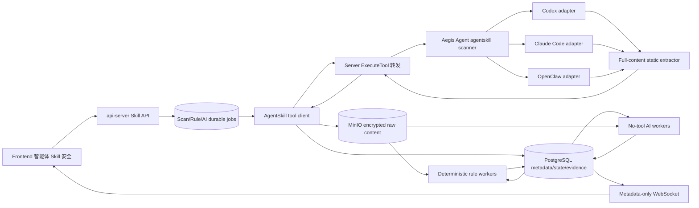
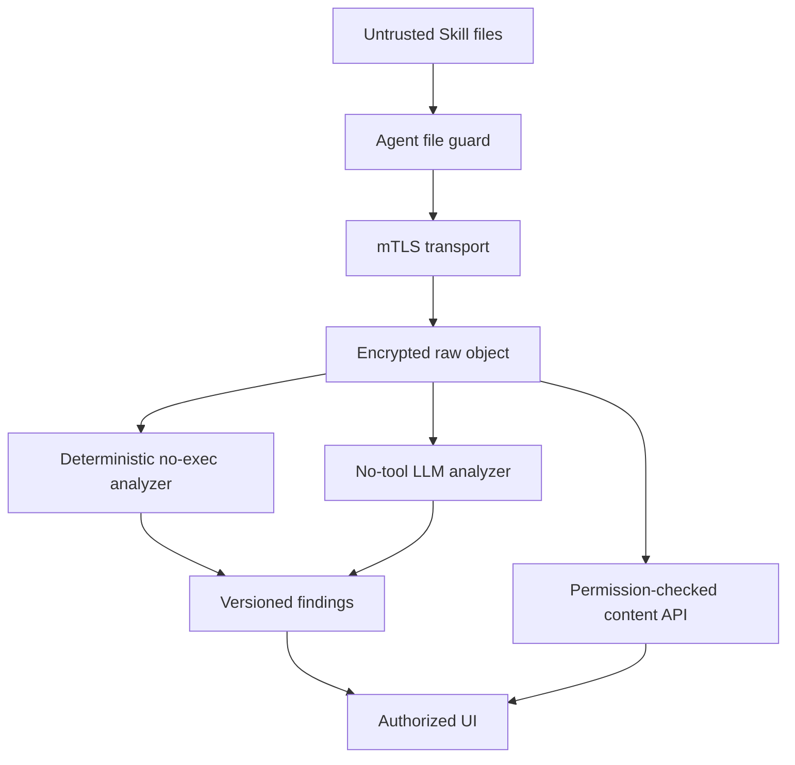

# Aegis V6.4 智能体 Skill 安全总体架构

## 1. 当前基线

现有代码已经提供以下可复用能力：

- `agent/internal/assets/ai_agent_collector.go`：智能体配置根发现；
- `agent/internal/assets/agent_config_collector.go`：固定路径、只读、有界的配置读取；
- `AgentConfigScan`：api-server -> Server -> Agent 白名单工具链；
- V6.2 Agent Guard：host、instance、UID、session、tool 和 eBPF 行为证据；
- V6.3 会话感知：版本化提示词规则、无工具 AI、证据定位和独立风险结果；
- PostgreSQL、MinIO、RBAC、WebSocket、审计和 durable worker 基础。

现有 AI asset/config scan 只返回配置摘要，不适合承载完整 Skill bundle、不可变 revision、
跨文件分析和历史研判。V6.4 建立独立领域表和服务，不把 Skill 当普通配置文件或会话 item。

## 2. 目标架构



## 3. 业务链路

### 3.1 扫描控制链

```text
Manual/Scheduler
  -> create agent_skill_scan_jobs
  -> worker validates RBAC/host/policy/capability
  -> ExecuteTool AgentSkillScan(page cursor)
  -> Agent resolves signed roots and adapters
  -> page result
  -> validate digest and persist
  -> next cursor until terminal coverage
```

HTTP 和 Tool request 不传路径。Agent 必须以本地已验签 collection policy 为最终权限边界；
请求的 scope/content mode 只能收窄 policy，不能扩大。

### 3.2 完整内容链

```text
SKILL.md / reference / script raw bytes
  -> file guard and size checks
  -> immutable file fragments
  -> mTLS Agent -> Server -> api-server
  -> fragment digest reassembly
  -> encrypted MinIO raw object
  -> PostgreSQL object ref + manifest + digest
```

原文不脱敏、不掩码。为了避免链路无意扩散：Server 只透明转发，不解析内容；api-server
只在 scan ingest、rule/AI worker 和授权 content API 读取对象；日志、错误、指标、通知和
WebSocket 不携带原文。

### 3.3 规则链

```text
revision object committed
  -> create rule watermark/run
  -> parse original text into spans and match views
  -> provenance/shadow/drift rules
  -> prompt/injection/jailbreak rules
  -> script/capability rules
  -> findings + evidence offsets
  -> risk projection
```

### 3.4 AI 链

```text
manual / rule_hit_only / all_changed trigger
  -> data egress policy check
  -> full raw-content chunks
  -> no-tool model client
  -> JSON schema + evidence ownership validation
  -> hierarchical reduce
  -> independent AI verdict
```

AI 使用完整原文。启用外部模型意味着完整 Skill 内容会发送给配置的 provider，必须在设置
中记录 provider、data policy acknowledgement 和启用者；未确认时只运行确定性规则。

### 3.5 查询链

```text
Frontend
  -> metadata API (agent_skill:read)
  -> content API (agent_skill:content:read + host scope)
  -> MinIO ownership validation
  -> raw text response, no-store
```

WebSocket 只通知 scan ID、revision ID、finding count 和状态变化，前端按权限重新查询。

## 4. 组件职责

### 4.1 Agent

- 加载签名 collection policy；
- 解析 UID/home/workspace/state/plugin roots；
- 使用 Codex、Claude Code、OpenClaw adapter 发现 Skill；
- 校验 owner、realpath、symlink、file type、size 和 TOCTOU；
- 原样读取 frontmatter/body/reference/script；
- 生成 manifest、file digest、revision digest、reference graph 和 page fragment；
- 保存短期 scan cursor/checkpoint，支持幂等分页；
- 不执行命令、动态上下文、脚本、变量替换、URL 或安装器；
- 不做提示词语义判断。

### 4.2 Server

- 复用 ExecuteTool 认证 host/Agent connection；
- 转发固定 `AgentSkillScan` 请求和响应；
- 应用 gRPC message limit 和 timeout；
- 不记录 Tool result、不解析原文、不写数据库/MinIO；
- 返回 Agent offline/timeout/unsupported 的稳定错误。

### 4.3 api-server

- RBAC、host scope、scan request 和设置管理；
- durable scan worker、分页、重试、object reassembly 和 MinIO 写入；
- Skill/revision/binding/observation 投影；
- effective/shadow/drift 计算；
- durable rule/AI workers 和综合风险；
- content API、revision diff、finding review、baseline 和审计；
- metadata-only WebSocket 通知。

### 4.4 DC

V6.4 首版不新增 Kafka topic，DC 无新职责。Skill 静态扫描是控制面任务；运行时关联从
现有 Agent Guard 表读取。若未来引入 Agent 主动实时推送，需另行设计 Kafka/投影链路。

### 4.5 PostgreSQL

- 保存任务、coverage、Skill identity/binding/revision/observation；
- 保存 file manifest、规则目录/run/finding、AI run/chunk、baseline/review/audit 索引；
- 不保存完整大段原文；短 evidence excerpt 可以保存原文，但受正文权限保护。

### 4.6 MinIO

- 保存完整原始 Skill revision 对象和可选 diff artifact；
- 服务端加密、digest、tenant/host/revision ownership 和 retention；
- object key 使用 UUID，不把路径/Skill 名称暴露在 bucket key；
- 不向浏览器返回长期签名 URL，优先由 api-server 流式代理。

### 4.7 Frontend

- 提供列表、任务、详情、原文、findings、AI、history、behavior；
- 按正文权限延迟请求完整内容；
- 原文纯文本显示，不渲染 Markdown/HTML/SVG/URL；
- 不将正文写入 route、store persistence、console、analytics 或错误上报。

## 5. 统一领域模型

```text
AgentSkillScanJob
  ├── AgentSkillScanPage[]
  └── AgentSkillScanCoverage[]

AgentSkill
  ├── AgentSkillBinding[]
  ├── AgentSkillRevision[]
  │     ├── AgentSkillRevisionFile[]
  │     ├── AgentSkillReferenceEdge[]
  │     ├── AgentSkillRuleRun[] -> AgentSkillFinding[]
  │     └── AgentSkillAIRun[] -> AgentSkillAIChunk[]
  ├── AgentSkillScanObservation[]
  ├── AgentSkillBaseline[]
  └── AgentSkillReviewAction[]
```

### 5.1 Skill identity

```text
host_id + source_subject_uid + agent_type
  + source_root_id + relative_skill_locator
```

同名不同路径不能合并。同一物理目录被 Codex/OpenClaw 同时发现时，允许共享原文 object，
但必须建立两个 binding，保留不同产品语义。

### 5.2 Revision identity

```text
revision_digest = SHA256(
  canonical adapter metadata
  + sorted file path/type/mode/owner/symlink state
  + original file content digests
)
```

原始字节完全一致且 manifest 不变时复用 revision；mtime 只进入 observation，不进入 digest。

### 5.3 风险分层

```text
provenance_risk
deterministic_risk
ai_risk
behavior_stage/risk
coverage_state
overall_risk (read-only projection)
```

## 6. 信任边界



边界规则：

- Skill 内容完全不可信，即使位于 enterprise/admin 目录；
- 完整原文是受保护数据，不代表可信指令；
- 静态 scanner 只能读取，不拥有执行权限；
- Server 不成为内容存储或分析层；
- AI 不能拥有工具或处置能力；
- 前端不能把内容解释成 HTML/Markdown command；
- 只有行为证据能证明实际执行。

## 7. 状态机

### 7.1 Scan

```text
queued -> dispatching -> collecting -> storing -> rules_pending
  -> rules_running -> completed
                         └-> ai_pending -> ai_running -> completed

active state -> partial | failed | cancelled
```

`partial` 是有数据但覆盖不完整的终态，不等于 failed 或 completed-clean。

### 7.2 Rule/AI run

```text
pending -> running -> succeeded
                   -> failed | invalid_output | inconclusive | cancelled
```

### 7.3 Skill lifecycle

```text
new_unbaselined -> active -> changed -> active
                        └-> disappeared -> reappeared
```

baseline 和 review 是旁路审计状态，不改变 observed revision。

## 8. 容量与流控

默认预算：

```text
max_skills_per_scan        2000
max_files_per_skill         256
max_file_bytes          2097152
max_skill_bytes        16777216
max_scan_bytes        268435456
max_tool_page_bytes       524288
max_scan_duration_ms_per_page 20000
```

超限时必须返回 continuation cursor 或明确 `budget_exhausted/too_large`。不能为了“完整”
取消所有边界；“完整原文”表示允许范围内不修改内容，而不是无限资源读取。

## 9. 可用性与失败行为

| 故障 | 行为 |
| --- | --- |
| Agent 离线 | job 等待/失败，旧 inventory 标 stale |
| root 不存在 | root_not_found，不等于没有其他 source |
| 权限不足 | permission_denied，不 sudo/提权 |
| unknown adapter | unsupported，不全盘猜测 |
| 文件超限 | metadata + too_large，scan partial |
| page timeout | 相同 cursor 幂等重试 |
| page digest conflict | quarantine page，job failed，不覆盖 revision |
| PostgreSQL 失败 | 不推进 durable cursor |
| MinIO 失败 | metadata 可保存，full content unavailable，job partial |
| 规则失败 | rule failed，原文仍可查，不标 clean |
| LLM 未授权/不可用 | AI not_run/failed，规则结果保留 |
| WebSocket 断开 | UI REST refresh，已加载 metadata 保留，原文按安全策略清空或重新请求 |

## 10. Feature flags

```text
AGENT_SKILL_SECURITY_ENABLED=false
AGENT_SKILL_METADATA_COLLECTION_ENABLED=false
AGENT_SKILL_FULL_CONTENT_COLLECTION_ENABLED=false
AGENT_SKILL_RULE_ANALYSIS_ENABLED=false
AGENT_SKILL_AI_ANALYSIS_ENABLED=false
AGENT_SKILL_SCHEDULED_SCAN_ENABLED=false
AGENT_SKILL_BEHAVIOR_LINK_ENABLED=false
```

父开关关闭时子功能全部关闭。AI 必须同时满足 full content、provider data policy 和自身开关。

## 11. 核心 ADR

| 决策 | 选择 | 未选择原因 |
| --- | --- | --- |
| 内容模式 | 完整原文，不脱敏 | 用户需要精确研判和 byte/digest 对账 |
| 内容存储 | MinIO 加密对象 + PostgreSQL 索引 | PostgreSQL 大正文成本和权限面过大 |
| 采集通道 | 现有 ToolExecute 分页 | 首版低频控制面任务无需 Kafka/新 stream RPC |
| 分析归属 | api-server | 与 V6.3 规则/LLM/权限归属一致 |
| Server | 透明转发 | 避免增加原文存储/分析职责 |
| 自动处置 | 不实现 | 静态 finding 不能证明执行，误伤风险高 |
| 未知产品格式 | fail closed | 通用递归会扩大任意文件读取面 |
| AI 输入 | 完整原文、管理员确认数据外发 | 避免脱敏导致攻击语义丢失，同时显式管理 egress |
